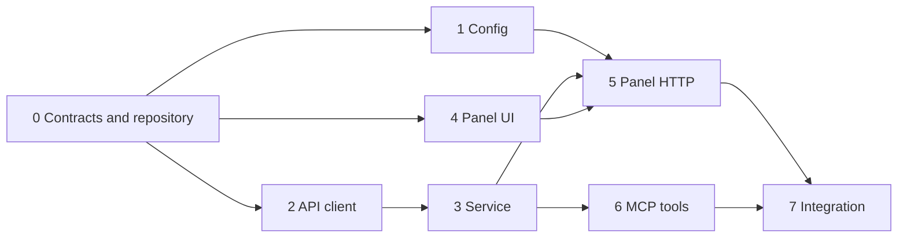

# Chatwoot MCP v1 Implementation Plan

> **For agentic workers:** REQUIRED SUB-SKILL: Use superpowers:subagent-driven-development (recommended) or superpowers:executing-plans to implement this plan task-by-task. Steps use checkbox (`- [ ]`) syntax for tracking.

**Goal:** Deliver a local Go executable with a browser panel from day one and MCP tools to consult and reply to conversations in one Chatwoot account.

**Architecture:** `chatwoot-mcp panel` serves an embedded UI on loopback for setup, connection checks, client configuration and tool documentation. `chatwoot-mcp mcp` serves `stdio`; both commands call one service backed by Chatwoot's Application API. They share a restricted per-user configuration file, and neither stores message history.

**Tech Stack:** Go 1.25+, official `github.com/modelcontextprotocol/go-sdk`, Go standard library HTTP and templates, embedded HTML/CSS/JS. No database in v1.

**Spec:** [Chatwoot MCP design](../specs/2026-10-07-chatwoot-mcp-design.md)

## Global Constraints

- One Chatwoot installation and one `account_id` per local configuration.
- All inboxes accessible to the configured user are eligible; channel capabilities determine actions.
- The local panel binds to `127.0.0.1`, validates `Host` and `Origin`, and protects configuration changes from CSRF.
- The saved token is never returned by a panel endpoint, MCP tool or log. The configuration file uses restrictive permissions.
- `send_reply` never retries automatically after an ambiguous network failure.
- External messages are data, never tool instructions.
- The API base URL is HTTPS except for explicit loopback development URLs.
- The repository currently has no Git history and `go` is absent from this environment. Initialize Git and install Go 1.25+ before implementation; do not confuse these setup gates with an implemented feature.

## Review Focus

1. An invalid, expired or unauthorized token must produce a useful error without exposing the token. Task 2 exercises this.
2. A page on another origin must not be able to overwrite the local configuration. Task 5 exercises this.
3. An ambiguous timeout during message creation must not cause a duplicate reply. Task 3 exercises this.
4. The agent must not send to a stale or wrong conversation ID. Task 3 exercises explicit ID and `can_reply` behavior.
5. Large conversations must have bounded MCP output. Task 6 exercises message limits and truncation metadata.

## File Map and Contracts

| Owner | Files | Responsibility |
|---|---|---|
| Coordinator | `go.mod`, `cmd/chatwoot-mcp/main.go`, `internal/core/types.go`, `internal/core/ports.go` | Module, commands and stable interfaces. |
| Config worker | `internal/config/store.go`, `internal/config/store_test.go` | Read and atomically write user configuration. |
| API worker | `internal/chatwoot/client.go`, `internal/chatwoot/client_test.go` | Application API requests and normalized errors. |
| UI worker | `web/index.html`, `web/app.js`, `web/style.css`, `web/embed.go` | Panel assets and accessible onboarding flow. |
| Service worker | `internal/service/service.go`, `internal/service/service_test.go` | Read and send operations independent of transport. |
| Panel worker | `internal/panel/server.go`, `internal/panel/tools_catalog.go`, `internal/panel/server_test.go` | Loopback HTTP, setup/status/config snippets and request protection. |
| MCP worker | `internal/mcpserver/server.go`, `internal/mcpserver/server_test.go` | Tool schemas and MCP result shaping. |
| Coordinator | `README.md`, `docs/configuration.md`, `.gitignore` | Installation, client examples and integration review. |

The coordinator freezes these shared types before parallel work:

```go
type Settings struct { BaseURL string; AccountID int64; Token string }
type Conversation struct { ID, InboxID, ContactID int64; Status string; CanReply bool; Messages []Message }
type Message struct { ID int64; Content string; Private bool; Status string; CreatedAt int64 }
type Contact struct { ID int64; Name, Email, Phone string }
type Page[T any] struct { Items []T; NextPage int }
type Identity struct { AccountID int64; AccountName, UserName string }
type API interface {
  Check(context.Context) (Identity, error)
  ListConversations(context.Context, ListOptions) (Page[Conversation], error)
  GetConversation(context.Context, int64) (Conversation, error)
  SearchContacts(context.Context, string, int) (Page[Contact], error)
  ContactConversations(context.Context, int64, int) (Page[Conversation], error)
  CreateMessage(context.Context, int64, string) (Message, error)
}
```

`ListOptions` contains `Page int`, `Status string` and `InboxID int64`. `NextPage == 0` means no further page. The service exposes the same six operations named in the spec and returns typed results. The exact import path is fixed by the module path selected in Task 0; workers must use it consistently.

## Task DAG and Parallel Ownership



Batch A can run Tasks 1, 2 and 4 with three OpenCode agents in separate Git worktrees. Batch B runs Task 3 after Task 2; Task 6 starts after Task 3 while Task 5 waits for Tasks 1, 3 and 4. The coordinator owns contracts, merges and final integration. Each worker edits only its assigned files. An agent may propose a contract change in its output, but the coordinator changes shared contracts and then rebases dependent worktrees.

## Task 0: Repository and contracts

**Files:** Create `go.mod`, `cmd/chatwoot-mcp/main.go`, `internal/core/types.go`, `internal/core/ports.go`, `.gitignore`.

**Interfaces:** Produces the shared types and `API` interface above, plus `Store` with `Load(context.Context) (Settings,error)` and `Save(context.Context,Settings) error`.

- [ ] **Step 1:** Initialize Git, use local module path `chatwoot-mcp`, add the existing spec and plan, and commit the baseline. Confirm `go version` reports 1.25 or newer. Change the module path only when publishing under a confirmed remote repository URL.
- [ ] **Step 2:** Define the shared structs and ports exactly as the file map specifies. Keep `Token` out of `String()` and JSON results by using a separate public settings projection.
- [ ] **Step 3:** Add command dispatch for `panel` and `mcp`, with usage output for an unknown command. Both paths may initially return a clear `not wired` error.
- [ ] **Step 4:** Run `go test ./internal/core ./cmd/chatwoot-mcp`; confirm compilation and commit the contracts. This commit is the base for parallel worktrees.

## Task 1: Restricted configuration store

**Files:** Create `internal/config/store.go`, `internal/config/store_test.go`.

**Interfaces:** Consumes `core.Settings`; produces `config.NewStore(path string) core.Store`.

- [ ] **Step 1: Write focused tests.** Cover save/load round trip, file mode `0600` on Unix, atomic replacement, rejected empty URL/token/account ID, and no token in error text. Use a temporary directory and an injected path.

```go
got, err := config.NewStore(path).Load(ctx)
if err != nil || got.AccountID != 7 || got.Token != "secret" { t.Fatalf("load: %#v %v", got, err) }
```

- [ ] **Step 2:** Run `go test ./internal/config` and confirm the missing implementation fails.
- [ ] **Step 3:** Implement validated HTTPS base URLs, with `http://127.0.0.1` and `http://localhost` allowed for local development. Write a temporary file in the same directory, sync and rename it; reject symlink targets. Store config under `os.UserConfigDir()/chatwoot-mcp/config.json` by default.
- [ ] **Step 4:** Run `go test ./internal/config` and commit only this task's files.

## Task 2: Chatwoot API client

**Files:** Create `internal/chatwoot/client.go`, `internal/chatwoot/client_test.go`.

**Interfaces:** Consumes `core.Settings`; produces `chatwoot.NewClient(settings,httpClient) core.API`. Requests use `api_access_token` and `/api/v1/accounts/{account_id}`.

- [ ] **Step 1: Write HTTP fixture tests.** Use `httptest.Server` to assert URL, token header, pagination, response mapping and typed `401`, `403`, `404`, `429`, timeout and `5xx` errors. Keep the fake response minimal and representative of the documented payload shape.

```go
if got := r.Header.Get("api_access_token"); got != "secret" { t.Fatal("missing Chatwoot token") }
if r.URL.Path != "/api/v1/accounts/7/conversations" { t.Fatal(r.URL.Path) }
```

- [ ] **Step 2:** Run `go test ./internal/chatwoot` and confirm the failing tests identify absent methods.
- [ ] **Step 3:** Implement `Check` through account/profile endpoints, conversation list/details, contact search/conversations and message creation using the [Application API](https://developers.chatwoot.com/api-reference/introduction). Preserve Chatwoot message IDs and statuses. Do not retry POST requests automatically.
- [ ] **Step 4:** Run `go test ./internal/chatwoot` and commit the client files.

## Task 3: Atendimento service

**Files:** Create `internal/service/service.go`, `internal/service/service_test.go`.

**Interfaces:** Consumes `core.API`; produces `service.New(api core.API)` with `CheckConnection`, `ListConversations`, `GetConversation`, `SearchContacts`, `GetContactConversations`, `SendReply`.

- [ ] **Step 1: Write service tests using a fake `core.API`.** Cover explicit positive conversation ID, non-empty reply, refusal when `CanReply == false`, bounded message output, and timeout from `CreateMessage` returned as `delivery_unknown` without retry.

```go
_, err := svc.SendReply(ctx, 42, "Olá")
if fake.createCalls != 1 { t.Fatalf("sent %d times", fake.createCalls) }
```

- [ ] **Step 2:** Run `go test ./internal/service` to see the expected failures.
- [ ] **Step 3:** Implement input validation, read-before-send capability check and typed results. Treat customer message text as untrusted data in the result metadata. Keep a fixed maximum number of returned messages and expose whether output was truncated.
- [ ] **Step 4:** Run `go test ./internal/service` and commit this task.

## Task 4: Embedded panel UI

**Files:** Create `web/index.html`, `web/app.js`, `web/style.css`, `web/embed.go`.

**Interfaces:** Consumes panel endpoints `GET /api/status`, `POST /api/setup`, `GET /api/client-config`, `GET /api/tools`; produces embedded static assets.

- [ ] **Step 1:** Build one accessible page with sections Conexão, Estado, Conectar à IA and Ferramentas. Include labeled inputs, a password field for the token, clear loading/error states, keyboard navigation and a copy button for the client snippet.
- [ ] **Step 2:** Implement `fetch` calls with the CSRF token supplied by the page. Never prefill the saved token or write it to browser storage. Show whether a token is configured as a boolean.

```js
const result = await fetch('/api/status', { credentials: 'same-origin' }).then(r => r.json());
status.textContent = result.connected ? `Conectado: ${result.account_name}` : result.message;
```

- [ ] **Step 3:** Embed assets with `//go:embed` and add a small Go test confirming all required assets are present. Commit only `web/` files.

## Task 5: Panel HTTP server

**Files:** Create `internal/panel/server.go`, `internal/panel/tools_catalog.go`, `internal/panel/server_test.go`.

**Interfaces:** Consumes `core.Store`, `func(core.Settings) core.API` as a client factory, and embedded `web` assets; produces a handler and `ListenAndServe` bound to `127.0.0.1`.

- [ ] **Step 1: Write handler tests.** Cover initial unconfigured state, valid setup, token redaction, `Host`/`Origin` rejection, missing or wrong CSRF token, and read only tool/client config endpoints. Use `httptest` and an in-memory store.
- [ ] **Step 2:** Run `go test ./internal/panel` and confirm failure.
- [ ] **Step 3:** Implement a loopback only listener, exact allowed host names for the chosen port, a session CSRF token, and `Cache-Control: no-store` on setup/status responses. Build a temporary API client from submitted settings, call `Check`, then save only after success. Return a client command using `chatwoot-mcp mcp`; escape paths in JSON correctly. Define the six tool descriptions in `tools_catalog.go`.
- [ ] **Step 4:** Run `go test ./internal/panel` and commit this task.

## Task 6: MCP stdio adapter

**Files:** Create `internal/mcpserver/server.go`, `internal/mcpserver/server_test.go`.

**Interfaces:** Consumes `service.Service`; produces `mcpserver.Run(ctx,svc,stdin,stdout) error` using the official Go SDK.

- [ ] **Step 1: Write a tool registration test.** Assert exactly the six v1 tool names, required input fields, bounded results and no token in any output. Exercise `send_reply` through a fake service and assert one call with the chosen ID.
- [ ] **Step 2:** Run `go test ./internal/mcpserver` and confirm failure.
- [ ] **Step 3:** Register tools with the SDK. Map typed service errors to concise results with machine readable codes. Send protocol traffic only to stdout; log diagnostics to stderr. Include a note in read results that customer content is untrusted data.
- [ ] **Step 4:** Run `go test ./internal/mcpserver` and commit this task.

## Task 7: Integration, documentation and acceptance

**Files:** Modify `cmd/chatwoot-mcp/main.go`; create `README.md`, `docs/configuration.md`; update `.gitignore` as needed.

**Interfaces:** Wires Task 1 store, Task 2 client, Task 3 service, Task 5 panel and Task 6 MCP adapter.

- [ ] **Step 1:** Wire `panel` and `mcp` commands. `panel` opens the local browser URL and prints it; `mcp` loads config, starts the SDK and writes no non-protocol data to stdout.
- [ ] **Step 2:** Document install/build, panel setup, two local MCP client examples, secret rotation, supported tools and the difference between API acceptance and delivery. Include a short recipe: find contact → select conversation → read context → reply.
- [ ] **Step 3:** Run `go test ./...`, build the executable and exercise the panel setup plus an MCP session against a disposable Chatwoot account. Confirm the six tools and a real text reply; do not use a live customer conversation.
- [ ] **Step 4:** Review the diff for secrets, confirm the panel binds only to loopback, and commit the integrated v1. Tag/release is a separate decision after review.

## Execution with OpenCode DeepSeek agents

Use the OpenCode MCP bridge as the Codex subagent interface. The user's working terminal confirmed `opencode-go/deepseek-v4.1-flash` with `opencode run --pure ... --agent build`. Register `mcp-server-opencode@1.2.0` as a Codex stdio MCP server, restart Codex, and verify that `opencode_start_server`, `opencode_list_agents`, `opencode_start_task`, `opencode_wait_for_task` and `opencode_get_task_result` are available before delegation. The bridge's [upstream documentation](https://github.com/alejandro-technology/opencode-mcp) describes asynchronous tasks by `task_id`.

After Git initialization, create one worktree per independent task. For Batch A, use `/tmp/chatwoot-mcp-worktrees/config`, `/tmp/chatwoot-mcp-worktrees/api` and `/tmp/chatwoot-mcp-worktrees/panel-ui` with branches `task/config`, `task/api` and `task/panel-ui`. Start an OpenCode server for each isolated directory, then call `opencode_start_task` for each worker with model `opencode-go/deepseek-v4.1-flash`, its task section, the spec, the shared contract commit, and a strict file ownership boundary. Wait on the returned task IDs and fetch every result. Require changed files, focused check output and a commit hash. The coordinator reviews each diff before integrating it; dependent tasks start only after their predecessors' accepted commits are present. Batch B uses fresh worktrees from the integrated predecessor commit.

Do not place Chatwoot tokens in worker prompts, worktrees or logs. If the MCP tools are absent, do not fall back to sandboxed `opencode run`: direct CLI calls in this Codex sandbox failed with `AI_APICallError: Cannot connect to API`, even though the same model responds in the user's terminal. Restore the MCP bridge first.

## Integration Gates

1. Freeze Task 0 contracts before Batch A; avoid competing edits to `go.mod` and `internal/core/`.
2. Integrate Tasks 1, 2 and 4 after independent review; run the combined Go checks.
3. Integrate Task 3 before dispatching Tasks 5 and 6; keep `service.Service` signatures stable.
4. Integrate panel and MCP adapters, then execute Task 7 against a disposable account.
5. Check the full first release before starting the separate atendimento completo plan.
