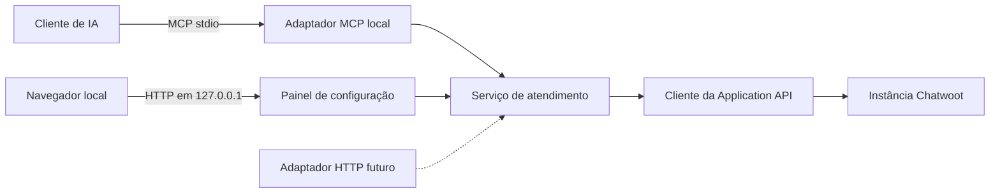

# Chatwoot MCP — desenho e evolução

## Objetivo

Criar um servidor MCP para uma pessoa operar uma conta Chatwoot por meio de um agente de IA. A primeira entrega permite consultar conversas e responder clientes. A evolução cobre o fluxo completo de atendimento em todas as caixas de entrada da conta. O projeto começa localmente e mantém as operações independentes do transporte para permitir um endpoint remoto depois.

## Referências e diferença principal

Os projetos [whatsapp-mcp-local](https://github.com/BrOrlandi/whatsapp-mcp-local) e [whatsapp-mcp](https://github.com/BrOrlandi/whatsapp-mcp) inspiram a experiência: conectar a conta, oferecer ferramentas MCP com nomes e resultados claros, verificar a saúde da conexão, documentar receitas de uso e permitir expansão do modo local ao remoto.

O Chatwoot já oferece histórico, contatos e operações de atendimento pela [Application API](https://developers.chatwoot.com/api-reference/introduction). Por isso, o MCP consulta a API diretamente. Não copia mensagens para um banco próprio na primeira versão. O índice de eventos do `whatsapp-mcp` existe porque o backend WhatsApp usado ali não oferece uma rota para ler o histórico; essa condição não se aplica ao Chatwoot.

## Escopo e decisões

- Uma instalação Chatwoot, uma conta (`account_id`) e um token pessoal de usuário na primeira versão.
- Todas as caixas de entrada visíveis para esse usuário entram no escopo. As operações disponíveis variam conforme o canal.
- Execução local por MCP `stdio` primeiro. Acesso remoto por Streamable HTTP é uma etapa posterior e opcional.
- Go 1.25 ou posterior e o [SDK oficial de MCP para Go](https://github.com/modelcontextprotocol/go-sdk), alinhados aos projetos de referência e adequados a um executável único.
- Painel local no navegador desde a primeira entrega. Ele configura URL base, ID da conta e token, testa a conexão, mostra o estado e fornece a configuração MCP para copiar no cliente de IA.
- Um único executável oferece `chatwoot-mcp panel` para abrir o painel e `chatwoot-mcp mcp` para servir MCP por `stdio`. Os dois comandos compartilham o mesmo serviço e arquivo de configuração; o painel não precisa permanecer aberto para o MCP funcionar. Alterações de configuração passam a valer no MCP após reiniciar o cliente de IA.
- O token Chatwoot determina as permissões efetivas. O MCP não amplia o acesso do usuário.

## Arquitetura

O adaptador MCP valida argumentos e traduz resultados do serviço em ferramentas. O serviço implementa ações de atendimento sem depender de `stdio` ou HTTP. O cliente da API concentra autenticação, URL, serialização, paginação, limites de tempo e tratamento dos códigos de erro. Um módulo de capacidades verifica `can_reply` e regras do canal antes das ações, sem presumir que todos os canais aceitam a mesma mensagem ou anexo.

Configuração e segredos ficam fora do código e do repositório, em um arquivo de dados do usuário com permissão restrita. O painel nunca devolve o token salvo ao navegador: oferece substituição e teste de conexão. Ele escuta somente em `127.0.0.1`, valida origem e protege ações de alteração contra requisições de outras páginas. O servidor não grava conteúdo de conversas por padrão. Registros de diagnóstico contêm IDs, duração e categoria de erro, sem token nem corpo de mensagem.

## Painel inicial

O painel é uma interface pequena, incluída no executável, com quatro áreas: conexão (URL, ID da conta e token), estado (instância, conta, usuário e último teste), conectar à IA (blocos de configuração MCP para clientes locais) e ferramentas (lista de capacidades e exemplos de pedidos). O fluxo de instalação termina quando a conexão passa no teste e o usuário consegue copiar a configuração de seu cliente MCP. O painel exibe erros de URL, token ou permissão sem mostrar o segredo. Não implementa uma segunda caixa de entrada nem duplica a interface de atendimento do Chatwoot.

## Primeira entrega: consultar e responder

| Ferramenta MCP | Comportamento |
|---|---|
| `check_connection` | Confere acesso e devolve identificação da conta/usuário sem revelar o token. |
| `list_conversations` | Lista com paginação e filtros suportados pela API, como estado e caixa de entrada; informa a próxima página. |
| `get_conversation` | Traz dados da conversa, contato, estado, capacidade de resposta e mensagens com limite explícito. |
| `search_contacts` | Localiza contatos pelos campos suportados pela API; expõe claramente quando uma busca não é suportada. |
| `get_contact_conversations` | Lista as conversas ligadas a um contato para desambiguar destinatários. |
| `send_reply` | Envia texto para um `conversation_id` explícito e informa ID e estado retornados pelo Chatwoot. |

Fluxo: o agente localiza o contato/conversa, lê o contexto recente, formula a resposta e chama `send_reply` com o ID escolhido. A ferramenta executa somente o envio solicitado; não envia mensagens como efeito indireto de uma leitura. A resposta do MCP distingue aceitação pela API de entrega ao destinatário. Falhas ou restrições do canal são retornadas em linguagem útil, com o código original disponível para diagnóstico.

O conteúdo das mensagens de clientes é dado não confiável. As descrições e respostas das ferramentas deixam explícito que esse conteúdo não concede instruções ao agente. O token pessoal nunca é incluído no resultado de uma ferramenta.

## Evolução até atendimento completo

### Etapa 1 — Fundação local

Criar o executável, painel local, configuração, diagnóstico de conexão, cliente HTTP, contratos de resultados e adaptador MCP `stdio`. Documentar a instalação e a configuração de um cliente MCP. Critério de conclusão: o usuário configura a conta pelo painel, verifica a conexão, copia a configuração MCP e o servidor identifica a conta correta e classifica erros de URL, token e permissão.

### Etapa 2 — Consulta e resposta

Entregar as seis ferramentas da primeira versão. Critério de conclusão: o usuário consegue localizar uma conversa, ler o contexto, responder e ver o ID/estado da mensagem retornada. Listagens grandes exigem paginação e limites de saída.

### Etapa 3 — Atendimento completo

Adicionar leitura de caixas de entrada, agentes, equipes, etiquetas, contatos e detalhes de mensagens; nota interna; estados `open`, `pending`, `resolved` e `snoozed`; prioridade; atribuição a agente ou equipe; gestão de etiquetas; atualização de contato; anexos; e modelos aprovados quando exigidos pelo canal. Criar uma conversa nova somente nos canais em que a API e as regras do canal permitirem. Cada ação recebe IDs explícitos e devolve o estado final retornado pelo Chatwoot. Operações que substituem listas, como etiquetas, devem ler o estado atual ou mostrar que a chamada substituirá o conjunto existente.

Critério de conclusão: um atendimento pode ser localizado, respondido, anotado, atribuído, organizado e resolvido pelo MCP em cada canal aplicável. As limitações de cada canal são descritas pelo resultado, sem prometer uma capacidade universal. A [matriz de canais do Chatwoot](https://developers.chatwoot.com/self-hosted/supported-features) é a referência para janelas de envio, anexos e tipos de resposta.

### Etapa 4 — Busca e acompanhamento

Avaliar a necessidade de busca textual global e acompanhamento de novas mensagens a partir do uso real. Primeiro verificar o comportamento da versão Chatwoot utilizada e os endpoints disponíveis. Se a API não oferecer busca suficiente, definir um índice local opcional com sincronização, cobertura temporal, retenção e exclusão explícitas. Para eventos em tempo real, avaliar webhooks quando houver um serviço alcançável; a instalação local pode usar consulta periódica se o custo for aceitável. Não apresentar resultados parciais como histórico completo.

### Etapa 5 — Acesso remoto

Acrescentar um adaptador MCP Streamable HTTP para o mesmo serviço de operações. Exigir TLS, autenticação do cliente MCP, armazenamento seguro de segredos e proteção do endpoint. Definir separadamente o processo de instalação, atualização e diagnóstico. Acesso remoto só é necessário se houver clientes fora do computador local.

## Comportamento de falhas

- `401` e `403`: distinguir token inválido de falta de permissão quando a API permitir; orientar a conferir acesso sem expor o token.
- `404`: informar qual recurso não foi encontrado, preservando o ID pedido.
- `429` e falhas temporárias: respeitar o limite/tempo de espera informado pela API e limitar tentativas. Não repetir automaticamente `send_reply` após resposta ambígua, para evitar mensagens duplicadas.
- Erro de rede ou tempo esgotado durante envio: retornar resultado incerto e orientar a conferir a conversa antes de tentar novamente.
- Restrições de canal: informar a condição específica, como janela de WhatsApp ou necessidade de modelo aprovado, quando os dados disponíveis permitirem.

## Marcos de implementação

1. Definir contratos de ferramentas, formatos de erro e configuração; conferir os endpoints na versão Chatwoot alvo.
2. Implementar cliente da Application API, serviço de atendimento e armazenamento restrito da configuração.
3. Expor painel local e ferramentas de consulta e resposta pelo MCP `stdio`.
4. Documentar instalação e exemplos de uso; validar o fluxo do painel e do MCP com uma conta de teste.
5. Ampliar as ações até o fluxo completo, com verificação por tipo de caixa de entrada.
6. Decidir busca ampliada, acompanhamento e acesso remoto conforme a necessidade de uso.

## Fontes técnicas

- [Introdução à API do Chatwoot](https://developers.chatwoot.com/api-reference/introduction)
- [Lista e filtro de conversas](https://developers.chatwoot.com/api-reference/conversations/conversations-list)
- [Mensagens de uma conversa](https://developers.chatwoot.com/api-reference/messages/get-messages)
- [Envio de mensagens e anexos](https://developers.chatwoot.com/api-reference/messages/create-new-message)
- [Estado de conversa](https://developers.chatwoot.com/api-reference/conversations/toggle-status)
- [Capacidades por canal](https://developers.chatwoot.com/self-hosted/supported-features)
- [Arquitetura do whatsapp-mcp](https://raw.githubusercontent.com/BrOrlandi/whatsapp-mcp/main/docs/architecture.md)
